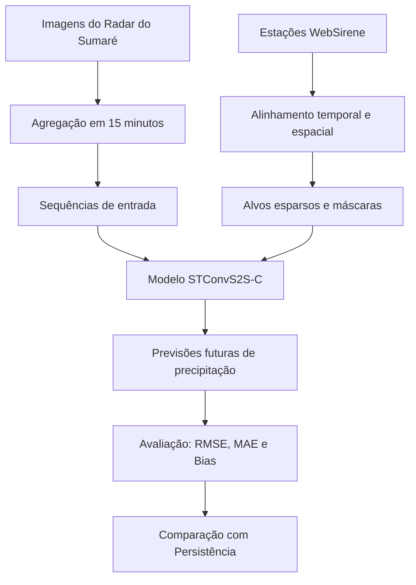

# 26_2-Integracao_de_Radar_Meteorologico_e_Estacoes_de_Superficie_para_Previsao_de_Precipitacao

**Título do TCC:** Integração de Radar Meteorológico e Estações de Superfície para Previsão de Precipitação 

**Aluna:** Noemi Cho de Almeida  

**Semestre de Defesa:** 2026-1  

[PDF do TCC](docs/monografia/TCC_2026_NoemiCho.pdf)

# TL;DR

Este repositório reúne os scripts usados nos experimentos do TCC para treinar e avaliar a arquitetura STConvS2S-C com imagens do Radar do Sumaré e medições WebSirene.

Para reproduzir o treinamento principal, é necessário ter o dataset anual em formato `memmap` no caminho esperado e executar:

```bash
nohup python -u main.py \
  -m stconvs2s-c \
  -dsp /atmoseer/data/datasets/radar_sumare_2012_2024_15min_256_por_ano \
  --years 2012-2024 \
  -b 8 \
  -e 10 \
  -i 1 \
  -w 0 \
  -s 5 \
  -c 0 \
  --verbose \
  > resultado_stconvs2s_2012_2024.log 2>&1 &
```

# Descrição Geral

Este trabalho avalia o uso de modelos espaço-temporais para previsão imediata de precipitação na Região Metropolitana do Rio de Janeiro, utilizando imagens do Radar Meteorológico do Sumaré e medições pluviométricas do sistema WebSirene.

A abordagem principal utiliza a arquitetura STConvS2S-C para receber sequências de imagens de radar e prever campos futuros de precipitação. Como as medições de chuva estão disponíveis apenas nos pontos das estações, foram construídos alvos esparsos e máscaras de observação para calcular a perda apenas onde há dados reais.

Algumas etapas de ingestão e pré-processamento dependem de funcionalidades desenvolvidas nos repositórios:

[atmoseer](https://github.com/AILAB-CEFET-RJ/atmoseer)

[stconvs2s](https://github.com/AILAB-CEFET-RJ/stconvs2s)

# Funcionalidades

* Construção do dataset espaço-temporal
  * agregação das imagens de radar em intervalos de 15 minutos;
  * redimensionamento das imagens para 256 x 256 pixels;
  * organização por ano e por sequência temporal.
* Construção dos alvos de precipitação
  * associação das estações WebSirene aos pixels do radar;
  * geração de campos esparsos de precipitação;
  * criação de máscaras de observação.
* Treinamento da STConvS2S
  * entrada com 5 imagens consecutivas de radar;
  * saída com 5 passos futuros de precipitação;
  * uso de função de perda mascarada.
* Avaliação dos resultados
  * cálculo de RMSE, MAE e Bias;
  * avaliação global;
  * avaliação por horizonte de previsão;
  * avaliação por faixa de intensidade de precipitação;
  * comparação com baseline de persistência.

# Arquitetura



# Dependências
* Python 3.10+
* PyTorch
* NumPy
* Pandas
* Matplotlib
* scikit-learn
* joblib
* OpenCV
* tqdm
* Repositório Atmoseer
* Repositório STConvS2S

# Execução

## 1. Preparar o dataset

O treinamento utiliza o dataset anual em formato memmap, com a seguinte estrutura:

```bash
radar_sumare_2012_2024_15min_256_por_ano/
├── year=2012/
│   ├── radar_frames.dat
│   ├── radar_timestamps.npy
│   ├── metadata.json
│   ├── Y_all.dat
│   ├── M_all.dat
│   └── targets_metadata.json
├── year=2013/
│   └── ...
...
└── year=2024/
    └── ...
```

Caminho esperado do dataset:

`/atmoseer/data/datasets/radar_sumare_2012_2024_15min_256_por_ano`

## 2. Instalar o ambiente

As dependências principais estão no repositório stconvs2s.

```bash
git clone -b noemi https://github.com/noemicho/stconvs2s.git
cd stconvs2s
```

Com Conda:

```bash
conda env create -f config/environment.yml
conda activate pytorch
```

Ou com pip:

```bash
python -m pip install torch torchvision matplotlib ipykernel h5py pandas xarray dask bottleneck statsmodels scikit-learn cartopy
```

## 3. Rodar o treinamento

```bash
nohup python -u main.py \
  -m stconvs2s-c \
  -dsp /atmoseer/data/datasets/radar_sumare_2012_2024_15min_256_por_ano \
  --years 2012-2024 \
  -b 8 \
  -e 10 \
  -i 1 \
  -w 0 \
  -s 5 \
  -c 0 \
  --verbose \
  > resultado_stconvs2s_2012_2024.log 2>&1 &
```

## 4. Acompanhar o treinamento

```bash
tail -f resultado_stconvs2s_2012_2024.log
```

Para verificar se ainda está rodando:

```bash
pgrep -af "main.py"
```

## 5. Saídas

Os checkpoints são salvos automaticamente em uma estrutura semelhante a:

`stconvs2s/output/full-dataset/checkpoints/stconvs2s-c/`

Os logs incluem as métricas globais, por horizonte e por faixa de intensidade de precipitação.

## Observação

Os dados brutos do Radar do Sumaré e das estações WebSirene não estão incluídos neste repositório. O acesso aos dados depende do contexto do projeto RioNowCast e das permissões de uso concedidas pelas instituições envolvidas.